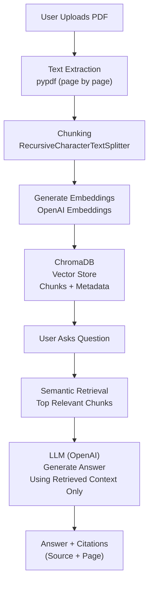
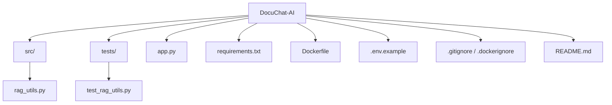

# How It Works

## Project Structure

### Example Questions
After uploading a PDF, users can ask questions like:
- What is this document about?
- What does the policy say about attendance?
- What is the sick leave policy?
- Summarize the important points from this PDF.
- What rules are mentioned in the document?
- Why This Project Matters

#### DocuChat AI demonstrates important real-world AI engineering concepts:

- Retrieval-Augmented Generation (RAG)
- semantic search
- document chunking
- vector databases
- grounded answer generation
- prompt control to reduce hallucinations
- source citation support
- session-based conversational UX

This makes the project relevant for:

- AI Engineer roles
- Software Engineer roles
- Backend Engineer roles
- Applied AI / LLM application roles

##### Local Setup
1. Clone the repository
git clone https://github.com/lohith-mudipalli/Docuchat-AI.git
cd Docuchat-AI

2. Create and activate a virtual environment
python3.11 -m venv venv
source venv/bin/activate

3. Install dependencies
pip install -r requirements.txt

4. Add environment variables
Create a .env file in the root directory and add:
OPENAI_API_KEY=your_openai_api_key_here

[if using the github api key - which will be created at the in the github by creating:
developer settings > personal access tokens > tokens(classic) > generate new token.]
OPENAI_BASE_URL=https://models.inference.ai.azure.com
OPENAI_EMBEDDINGS_MODEL_NAME=text-embedding-3-small
OPENAI_MODEL_NAME=gpt-4o-mini

5. Run the app
streamlit run app.py
Run with Docker
Build the image
docker build -t docuchat-ai .
Run the container
docker run -p 8501:8501 --env-file .env docuchat-ai

Then open:
http://localhost:8501

Testing
Run tests with:
python -m pytest

Resume-Friendly Description
DocuChat AI — RAG-Based Document Assistant
Built an AI-powered document assistant that enables users to upload PDFs, retrieve semantically relevant content using vector search, and receive grounded answers with source citations using Streamlit, LangChain, OpenAI, and ChromaDB.

Author
Lohith Reddy Mudipalli
GitHub: https://github.com/lohith-mudipalli
